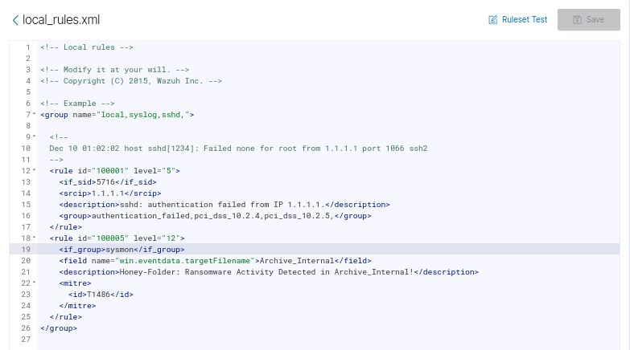
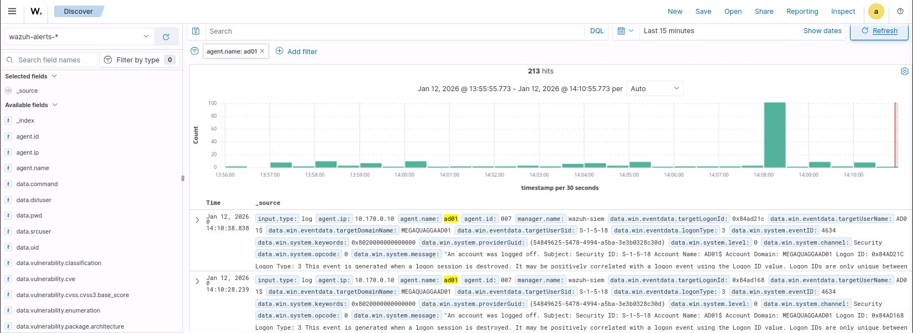
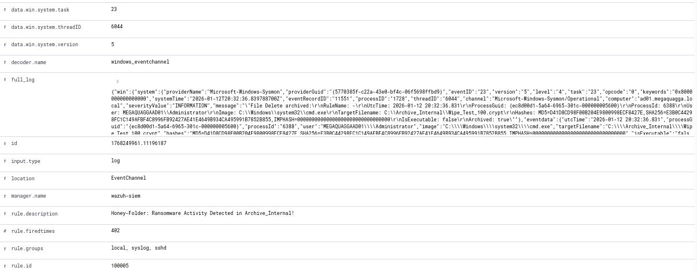
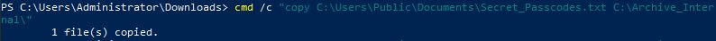
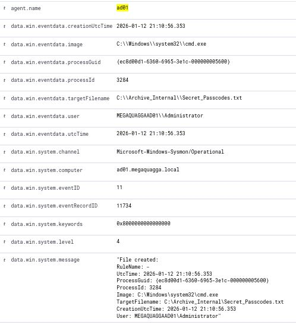

# Ransomware-Tripwire
A high-fidelity ransomware detection project using Sysmon and Wazuh custom rules.

**The Tripwire Tactic: Turning a Windows Endpoint into a Ransomware Trap**
*Lessons in Sysmon Troubleshooting and Custom Wazuh Rule-Tuning*
## 1. Introduction

### 1.1 "Teaser" overview

Most ransomware defenses are reactive—they wait for a known signature to appear. In this project, I flipped the script by building a "Honey-Folder" tripwire. By configuring a Windows endpoint to treat a specific directory as sacred ground, I created a high-fidelity detection system where any interaction triggers a critical alert in the Wazuh SIEM. This journey also taught me a critical lesson in telemetry integrity: sometimes the security tool itself hangs under pressure, requiring a manual driver refresh to stay in the fight.

### 1.2 Introducing yourself to the cyber community

I am an aspiring SOC Analyst and Detection Engineer documenting my journey through hands-on labs. My focus is on moving beyond "out-of-the-box" settings to understand the underlying telemetry that powers modern SOCs. This project demonstrates my skills in endpoint telemetry (Sysmon), custom XML rule-writing, and incident triage.

---

## 2. Setup

### The Architecture

The "Honey-Folder" defense relies on a three-node pipeline to move data from the endpoint to the analyst's eyes:

- **The Target (VM3):** A Windows 10 endpoint where the "Honey-Folder" (`C:\Archive_Internal`) was planted. This machine ran **Sysmon** to generate raw security events.
    
- **The Brain (VM4):** The **Wazuh SIEM Server**. This engine received logs via the Wazuh Agent, processed them against custom rules, and triggered alerts.
    
- **The Analyst Console (VM1):** A Blue Team Workstation used to monitor the Wazuh Dashboard.
    
- **Data Flow:** `Sysmon Events → Wazuh Agent → Wazuh Manager (Rule Matching) → Dashboard Alert`.

Figure 1: Custom Wazuh rule (ID: 100005) configured with a Level 12 severity to trigger on any file creation within the protected directory.

### The Configuration & The "Silent Service" Mistake

I updated the `sysmon-config.xml` on VM3 to filter for **Event ID 11 (FileCreate)** and **Event ID 23 (FileDelete)** within the `Archive_Internal` directory. On the Wazuh Manager, I edited `local_rules.xml` to include **Rule ID 100005**, set to **Level 12 (Critical)**.

> **The Mistake + Problem Solving:** During setup, I noticed my new rules weren't firing. I initially thought my XML syntax was wrong, but after checking the logs, I realized the Sysmon service had "zombied"—it was running but not processing the new config. Instead of a time-consuming reboot, I used the command `sysmon64.exe -c sysmon-config.xml` to force a configuration refresh directly into the driver. This "kick-started" the telemetry immediately.

---

## 3. Experiment time!

### Experiment #1: High-Frequency Entropy Simulation (Mass Encryption)

- **Inquiry:** Can Wazuh distinguish between a single file creation and a rapid-fire "encryption" event?
    
- **The Action:** I executed a PowerShell script on VM3 that generated 100+ files with the `.crypt` extension.
    
- **The Expectation:** I expected a massive spike in the "Security Events" dash within 10 seconds.
    
- **Analysis:** The result matched my expectation; Rule 100005 dominated the timeline. However, I noticed that 100 files generated 100 separate alerts. In a production environment, I realized I would need to implement **alert composition (frequency/syscheck)** to avoid flooding the analyst.

Figure 2: The 'Security Events' dashboard showing a sudden spike in alerts as the mass-encryption script populates the honey-folder.

### Experiment #2: Mass File Deletion (Data Destruction)

- **Inquiry:** Does the system capture the "cleanup" phase where ransomware deletes originals?
    
- **The Action:** I used the command line `cmd /c del` to purge the folder.
    
- **The Expectation:** Generation of Event ID 23 (FileDelete) logs for every file.
    
- **The Mistake + Problem Solving:** Initially, I tried deleting files via a modern PowerShell `Remove-Item` script, but the alerts were inconsistent—some deletions weren't showing up in Wazuh. I suspected the abstraction layer of PowerShell was bypassing the specific Sysmon filter. I pivoted to the legacy `cmd /c del` command, which interacts more directly with the file system. This triggered a 1:1 log-to-deletion ratio, confirming the fix.
    
- **Analysis:** I successfully exported the final log count to an XLSX file. This proved that even if the files are gone, the forensic "ghost" remains in the SIEM.

The `cmd /c del` command execution.

Figure 3: Forensic telemetry captured by Sysmon, showing the transition from file existence to deletion (Event ID 23) after the cleanup command was executed.

### Experiment #3: Manual Interaction Baseline (The Human Element)

- **Inquiry:** Is the threshold sensitive enough to catch a "low and slow" human intruder manually interacting with a single file, rather than a noisy script?
    
- **The Action:** I performed a "Safety Shuffle"—attempting to manually move `Secret_Passcodes.txt` from the desktop into the honey-folder, and subsequently trying a manual "Copy" and "Paste" operation.
    
- **The Expectation:** I expected the initial "Move" operation to trigger a **FileCreate (Event ID 11)** alert as the file entered the protected directory.
    
- **The Mistake + Problem Solving:** During the first attempt, **the "Move" operation failed to trigger an alert.** After investigating the Sysmon logs, I realized that because the move happened on the same logical drive, Windows simply updated the file’s pointers rather than "creating" a new file object that my specific Sysmon filter was looking for. To solve this and ensure the trap was effective, I tested a **Copy and Paste** operation instead. This forced the OS to write new data to the disk, which immediately triggered the Level 12 alert.
    
- **Analysis:** This highlighted a critical limitation in basic file-creation monitoring: "Moving" a file is often a silent operation at the telemetry level compared to "Copying" or "Writing." For a production environment, I now know I would need to expand my Sysmon configuration to include **Event ID 2 (A process changed a file creation time)** to catch these more subtle file system moves.

The manual "Copy/Paste" of the sensitive file.

Figure 4: Detailed alert payload in the Wazuh UI confirming that a manual copy-paste operation was successfully intercepted.

---

## 4. Conclusion

### 4.1 Summary of experimental findings
- **Exp 1:** Proved high-fidelity detection of automated scripts. High-frequency events are easy to spot but require rule-tuning to prevent alert fatigue.
- **Exp 2:** Demonstrated that legacy commands often trigger driver-level telemetry more reliably than modern wrappers.
- **Exp 3:** Confirmed that manual "Safety Shuffles" (moving files) trigger both a delete and a create event, ensuring human intruders cannot hide.
    

### 4.2 Advice on avoiding mistakes
1. **The Sysmon "Zombie" Service:** If your telemetry stops, don't reboot. Use `sysmon64.exe -c` to force-refresh the driver.
2. **The PowerShell Trap:** If a script isn't triggering an alert, try the legacy CMD equivalent. It's often "louder" to the kernel.

---

## 5. Final Thoughts

### 5.1 The coolest thing I learned
Learning how to force a driver refresh using `sysmon64.exe -c` when the service hung was a major highlight. It made me realize that security tools are just software that can be pushed to their limits; knowing how to maintain telemetry integrity under pressure is just as important as reading the alerts themselves. This experience sharpened my technical troubleshooting skills, a core competency for any analyst responsible for maintaining a reliable detection pipeline.

### 5.2 One piece of advice
Stay fluid in your methodology. When you encounter a roadblock—like when my PowerShell script failed to trigger the expected telemetry or when a file 'Move' didn't fire an alert—don't get stuck. Be ready to pivot to other avenues, like legacy CMD commands or alternative file operations, to validate your visibility. Flexibility and a "test-everything" mindset are what separate a successful analyst from a frustrated one.

### 5.3 My favorite resource
The Wazuh "Rules Syntax" Documentation was essential. Learning to map specific Windows `EventData` fields (like the target file path) into a custom XML rule allowed me to transform a generic log into a high-priority, actionable alert. Understanding this mapping is key to reducing noise and focusing on "True Positive" activity.

### 5.4 Thank you (gratitudes)!
I would like to thank the TripleTen Instructional Team for providing the architectural framework for this lab, and SwiftOnSecurity for their open-source `sysmon-config` templates. Your contributions to the community provided the baseline I needed to build and test this defensive strategy.

---

## 6. References

- **Title:** [Sysmon Documentation](https://learn.microsoft.com/en-us/sysinternals/downloads/sysmon)  
    - **Author:** Mark Russinovich and Thomas Garnier
    - **Author Affiliation:** Microsoft (Sysinternals)
    - **Date Published:** 2024
    - **Description:** This documentation was essential for identifying the specific Event IDs (11 and 23) needed for file monitoring and for learning the command-line switches used to refresh the Sysmon driver.
        
- **Title:** [Wazuh Ruleset XML Syntax Guide](https://documentation.wazuh.com/current/user-manual/ruleset/ruleset-xml-syntax/rules.html)
    - **Author:** Wazuh Documentation Team
    - **Author Affiliation:** Wazuh, Inc.
    - **Date Published:** 2025
    - **Description:** This guide provided the technical syntax required to create custom detection rules, allowing me to map raw XML log fields to specific alert levels in the dashboard.
        
- **Title:** [T1486: Data Encrypted for Impact](https://attack.mitre.org/techniques/T1486/)
    - **Author:** MITRE ATT&CK
    - **Author Affiliation:** The MITRE Corporation
    - **Date Published:** 2023
    - **Description:** This resource provided the "adversary mindset" for the project, helping me understand how ransomware behaves and why a honey-folder is an effective detection for this specific technique.
        
- **Title:** [T1485: Data Destruction](https://attack.mitre.org/techniques/T1485/)
    - **Author:** MITRE ATT&CK
    - **Author Affiliation:** The MITRE Corporation
    - **Date Published:** 2023
    - **Description:** I used this reference to model Experiment #2, ensuring my Sysmon filters were capturing the forensic artifacts left behind during malicious file deletion/wiping phases.
        
- **Title:** [Atomic Red Team (T1486 Tests)](https://github.com/redcanaryco/atomic-red-team/blob/master/atomics/T1486/T1486.md)
    - **Author:** Red Canary Team and Community Contributors
    - **Author Affiliation:** Red Canary
    - **Date Published:** 2024
    - **Description:** This library of tests served as the inspiration for my PowerShell scripts, providing examples of how to simulate mass file creation and encryption to test detection telemetry.
